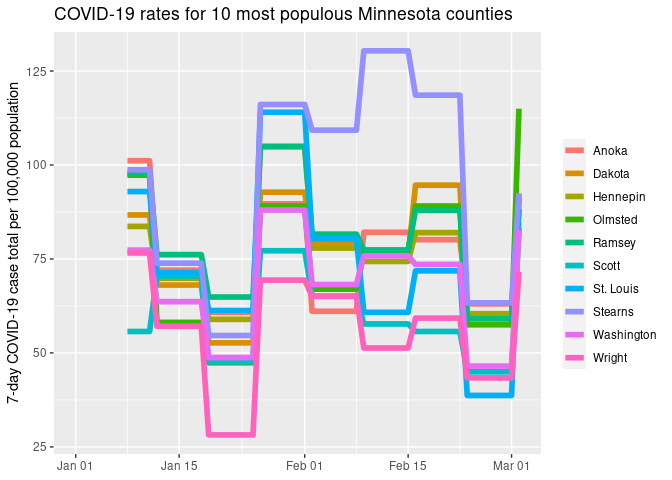
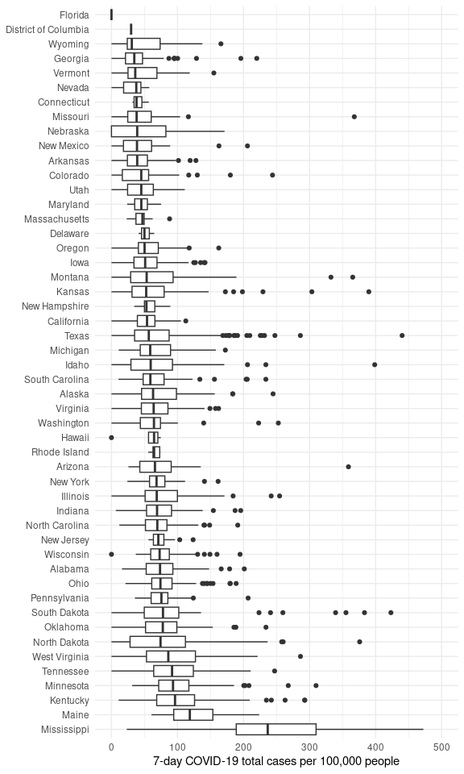

Minnesota COVID Report
================

## Introduction

This is an example report that uses COVID-19 data from the New York
Times to illustrate the use of automation processes.

First, we load some necessary libraries, define some key variables, then
read in the data:

``` r
library(dplyr)
library(ggplot2)
library(readr)
library(lubridate)
library(forcats)

LAG_DAYS <- 7
POP_DENOM <- 100000

## County populations
pops <- read_csv("countypop_us.csv")
## COVID-19 case counts from the NYTimes (updated daily)
county_data <- read_csv("https://raw.githubusercontent.com/nytimes/covid-19-data/master/us-counties-2023.csv")

rate_data <- county_data %>%
  select(date, state, county, cases) %>%
  mutate(date = ymd(date)) %>%
  left_join(pops, by = c("state", "county")) %>%
  group_by(state, county) %>%
  mutate(cases_lag = lag(cases, LAG_DAYS),
         totalcases_last = cases - cases_lag) %>%
  ungroup() %>%
  mutate(rate_last = totalcases_last / pop * POP_DENOM)
```

### Minnesota, by county

First, we generate a plot of COVID-19 rates since Jan. 1, 2023 in the 10
most populous Minnesota counties:

``` r
top10_pop <- pops %>% filter(state == "Minnesota") %>%
  arrange(desc(pop)) %>%
  slice(1:10) %>%
  mutate(county = factor(county))

rate_data %>%
    filter(state == "Minnesota", 
         county %in% top10_pop$county) %>%
  ggplot(aes(x = date, y = rate_last, color = county)) +
  geom_line(linewidth = 2) +
  xlab(NULL) +
  ylab("7-day COVID-19 case total per 100,000 population") +
  scale_color_discrete(name = "") +
  ggtitle("COVID-19 rates for 10 most populous Minnesota counties")
```



Last updated: 2023-03-03 07:05:40

### US, by state

Now, we show the number of cases, by county, for each state:

``` r
rate_data %>%
  filter(date == max(date),
         !is.na(rate_last)) %>%
  mutate(state = fct_reorder(factor(state), -rate_last, median, na.rm = TRUE)) %>%
  ggplot(aes(x = rate_last, y = state)) +
  geom_boxplot() +
  xlim(c(0,500)) +
  xlab("7-day COVID-19 total cases per 100,000 people") +
  ylab(NULL) +
  theme_minimal()
```


